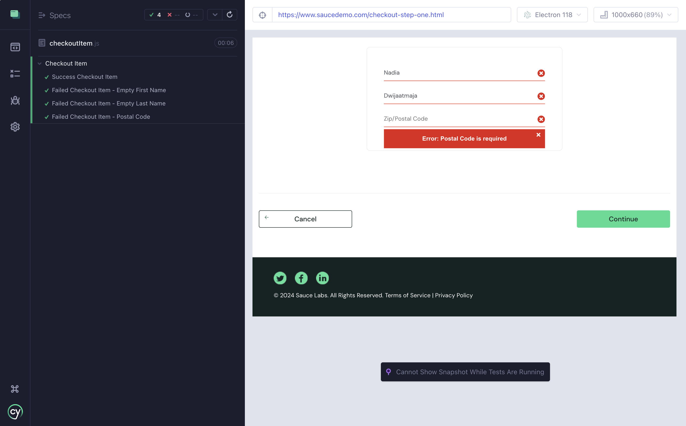
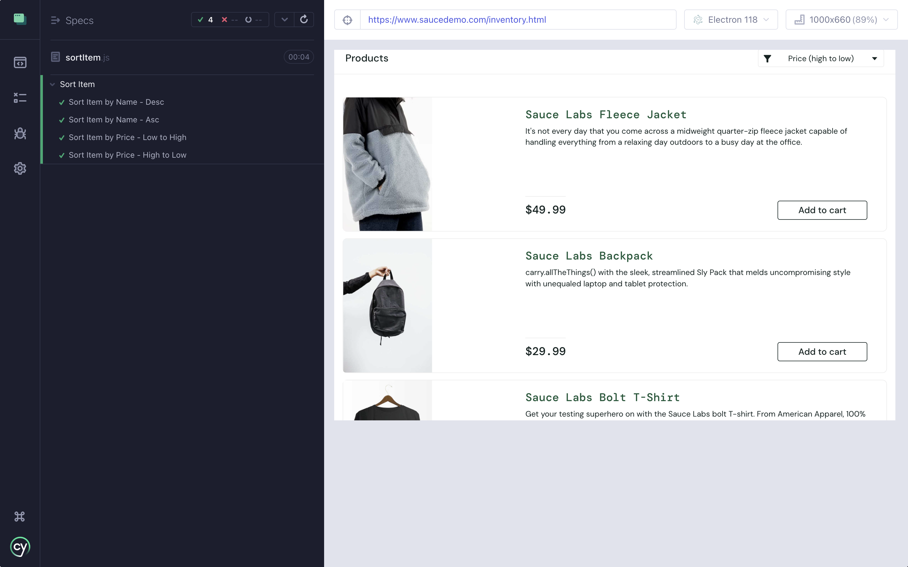

# sanbercode-cypress-web-automation
Web automation using Cypress, mochawesome-reporter\
Saucedemo.com - e2e checkout scenarios, sort item by name and price

## How to run:
* git clone https://github.com/nadiarizki/sanbercode-cypress-web-automation
* Open folder on Vscode
* run command "npx cypress run –spec cypress/e2e –browser chrome --headed"

## Sample report

